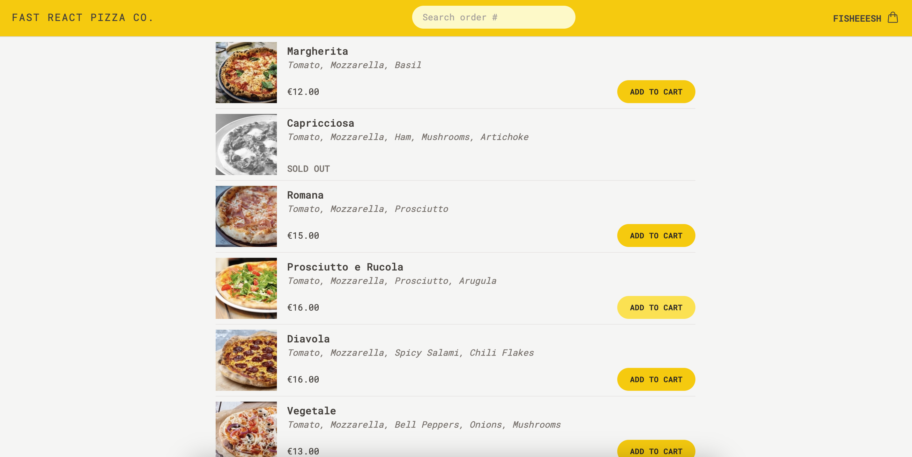

# 🍕 Fast React Pizza

A blazing-fast pizza ordering app built with **React**, **Redux**, **React Router**, and **Tailwind CSS**. Users can browse pizzas, customize orders, select quantity, and place orders with live delivery tracking and pricing—including a priority option!



## Live Demo

Demo - https://fast-react-pizza-six-gamma.vercel.app/


## Features

- Browse available pizzas with detailed info
- Choose any quantity for each pizza
- Auto-detect and use user's current location
- Enter personal and address info for order
- Priority order option (adds extra cost)
- Live Order Summary:
  - Order ID
  - Order details
  - Estimated delivery time
  - Total price
- Search orders by ID

---

## Tech Stack

- **Frontend:** React + Vite
- **Routing & Data Fetching:** React Router with Loaders
- **State Management:** Redux
- **Styling:** Tailwind CSS
- **Maps / Geolocation:** Browser Geolocation API

---

## Installation and Setup  
1. Clone the repository:  
   ```bash
   git clone https://github.com/fisheeesh/fast-react-pizza.git

   cd fast-react-pizza
2. Install Dependencies:
   ```bash
   npm install
3. Start the Application:
   ```bash
   npm run dev
## License

This project is licensed under the **MIT License**.  

[](https://opensource.org/licenses/MIT)  

You can view the full license [here](LICENSE).